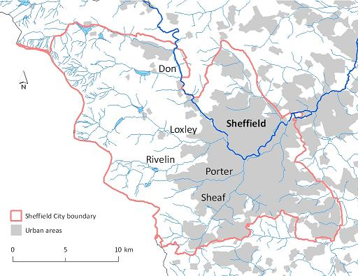
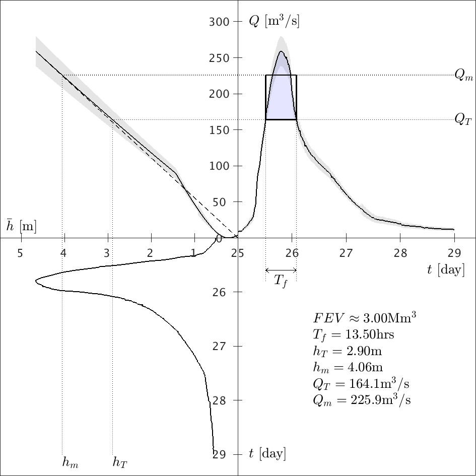
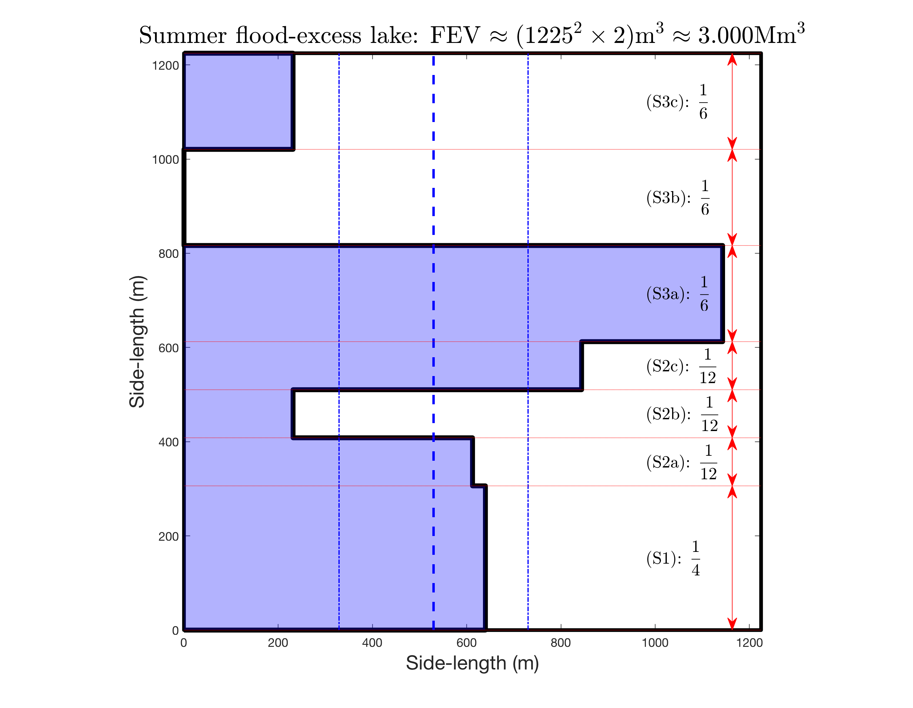
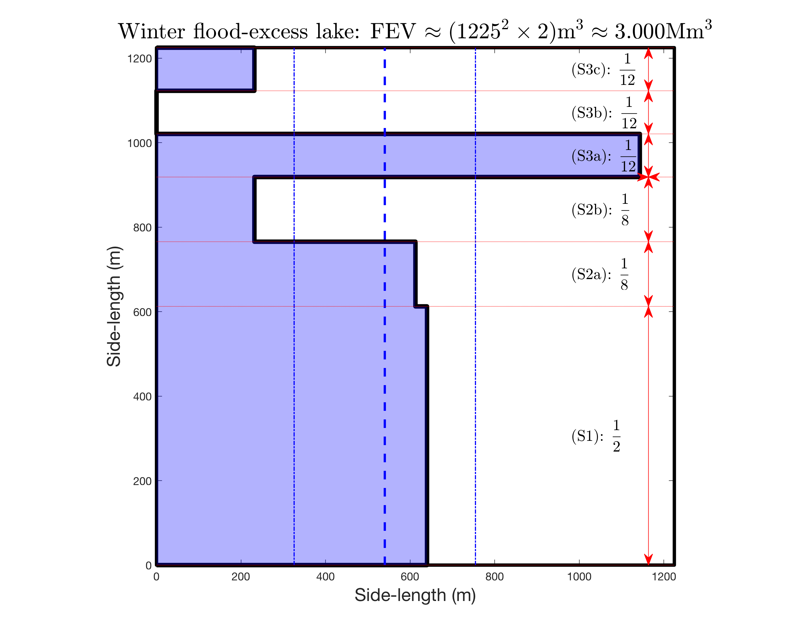

# River Don (Matlab) and several river floods (Python)



## FEV Matlab analysis for the summer 2007 flood of the River Don in Sheffield

Work published on the (Earth)Arxiv as: 

Bokhove, O., Kelmanson, M., & Kent, T. (2018): On using flood-excess volume to assess natural flood management, exemplified for extreme 2007 and 2015 floods in Yorkshire. *EarthArxiv*. [DOI](https://doi.org/10.31223/osf.io/87z6w).

*Above figure (source: University of Sheffield https://www.sheffield.ac.uk/doncatchment/about (c) Crown Copyright/database right 2011; an Ordnance Survey/EDINA supplied service; river layer kindly licensed from the Environment Agency): The River Don around the Sheffield City region, including the upper Don catchment and the River Sheaf. In Sheffield, the Don is fed by four other rivers: the Sheaf, Loxley, Riverlin, and Porter. The Sheffield Hadfields gauge is located centrally downstream of the Sheaf.*


### Some Graphical output 

#### Data analysis: from depth to discharge to FEV

From the ```/code``` dir, run: 
 * ```quadrantplot_sheff.m```
 
This carries out the FEV calculations and calls four plotting routines at the end of the sript:
 * ```plot3panelerr;```
 * ```plotFEVhT;```
 * ```plot_h_year;```
 * ```plot_ratingcurve;```
 



#### Cost-effectiveness analysis: seasonal rainfall scenarios

From the ```/code``` dir, run ```donfloodallev_auto_new.m```. Choose the season alternately:
```
nws = 1; % summer
% nws = 0; % winter
```

 |  
:-------------------------:|:-------------------------:

*Caption (adapted from fig. 9 in Bokhove, Kelmanson, Kent (2018)): A graphical overview of the fraction of the FEV captured by the two flood-storage measures, reservoirs and leaky dams in the reservoir and Upper Don areas of the Don catchment, respectively, for (a) the summer-rainfall scenarios and (b) the winter-rainfall scenarios. Stacked vertically are the respective probability distributions, relative to the associated FEV, which is fixed for all scenarios. The blue shaded areas to the left of the thick, stepped, solid line denote the fractions of the FEV mitigated per scenario, to be read horizontally (e.g., 93.3% for (S3a)). The mean FEV (winter 44.08%, summer 43.25%) over all 7 scenarios and standard deviation (winter 17.51%, summer 16.38%) are indicated by thick and thin vertical dashed lines respectively.*

## Python analysis floods: River Don 207/2019 in Sheffield/Rotherham, River Aire 2015 Leeds/Armley (WORK IN PROGRESS)

Contributors: Onno Bokhove with Zheming Zhang, extending code by Abbey Chapman and Mary Saunders (https://github.com/Rivers-Project-2018/). This work was first published in a report for the summer 2020 Data Science project at the School of Mathematics of the University of Leeds --report upload pending.

See latest version in subfolder Pythoncode. Copy files therein and run ```rivergentest.py``` after choosing the parameters/river flood therein by setting ```(nriver,nratngc,nriverflag)```. It has examples of River Aire flood 2015, Rver Don floods 2007/2019 at Sheffield Hadfields and Rotherham.

The River Don is an English river mainly in South Yorkshire and the East Riding of Yorkshire. It source lies in the Pennines and the river flows eastwardly through major British cities such as Sheffield, Rotherham and Doncaster, and eventually merges into the River Ouse. The total length of River Don is 70 miles (110km) and around 1.3 million people are living along the river. The River Aire flows in West Yorkshire, flowing eastwards and merging into the Humber River and flowing into the North Sea via the Humber Estuary.

### Graphical output

From the Pythoncode directory (updated version of ```/Integratedcode``` directory), run:
* ```rivergentest.py``` (updated version of ```FEVRiverDon.py```), by setting the bespoke input ```(nriver,nratngc,nriverflag)``` in that code.

The following four panel graphs have been produced using four relevant flood-data sets (slightly older figures; note that there are some discrepancies in values of FEVmax/min and QTmax/min to be sorted/sort it out; after running ```rivertestgen.py```):

 | 
:-------------------------:|:-------------------------:

 | 
:-------------------------:|:-------------------------:

* Caption: Top left and right are the integrated hydrographs of River Don in Sheffield 2007 and 2019 flood events, respectively. Bottom left and right are integrated hydrographs of River Don in Rotherham 2007 and 2019 flood events, respectively. 
Data sets: top-left: /data/SheffieldHadsfields2007.csv ; top-right: /data/SheffieldHadsfields 2019.csv ; bottom-left: /data/RotherhamDon2007.csv ; bottom-right: /data/DonTesco201911.csv (note that spaces in the data filenes have been removed relative to the old files)

#### Cost-effectiveness analysis

 | 
:-------------------------:|:-------------------------:


* Caption: Figures 1 and 2 are hypothetical schemes for Rotherham in both 2007 and 2019 River Don flood events, Figure 3 reveals the flood-mitigation schemes provided by Sheffield City Council; all of these three schemes could alleviate 100% of the flood water.


