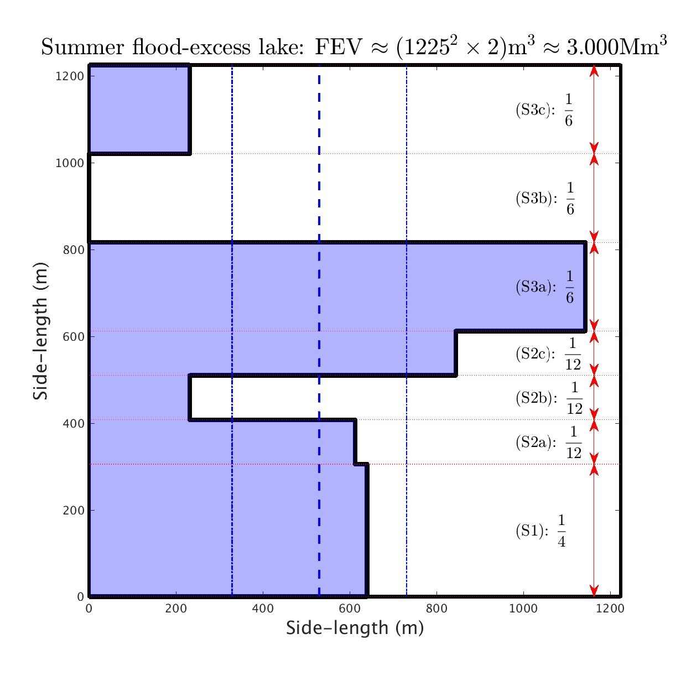

# RiverDon

## FEV analysis for the summer 2007 flood of the River Don in Sheffield

Work published on the (Earth)Arxiv as: 

Bokhove, O., Kelmanson, M., & Kent, T. (2018): On using flood-excess volume to assess natural flood management, exemplified for extreme 2007 and 2015 floods in Yorkshire. *EarthArxiv*. [DOI](https://doi.org/10.31223/osf.io/87z6w).

*Above figure (source: University of Sheffield https://www.sheffield.ac.uk/doncatchment/about (c) Crown Copyright/database right 2011; an Ordnance Survey/EDINA supplied service; river layer kindly licensed from the Environment Agency): The River Don around the Sheffield City region, including the upper Don catchment and the River Sheaf. In Sheffield, the Don is fed by four other rivers: the Sheaf, Loxley, Riverlin, and Porter. The Sheffield Hadfields gauge is located centrally downstream of the Sheaf.*

### Some Graphical output 

#### Data analysis: from depth to discharge to FEV

#### Cost-effectiveness analysis: seasonal rainfall scenarios

:-------------------------:|:-------------------------:
 |  
:-------------------------:|:-------------------------:

A graphical overview of the fraction of the FEV captured by the two flood-storage measures, reservoirs and leaky dams in the reservoir and Upper Don areas of the Don catchment, respectively, for (a) the winter-rainfall scenarios and (b) the summer-rainfall scenarios. Stacked vertically are the respective probability distributions, relative to the associated FEV, which is fixed for all scenarios. The blue shaded areas to the left of the thick, stepped, solid line denote the fractions of the FEV mitigated per scenario, to be read horizontally (e.g., 93.3% for (S3a)). The mean FEV (winter 44.08%, summer 43.25%) over all 7 scenarios and standard deviation (winter 17.51%, summer 16.38%) are indicated by thick and thin vertical dashed lines respectively.
