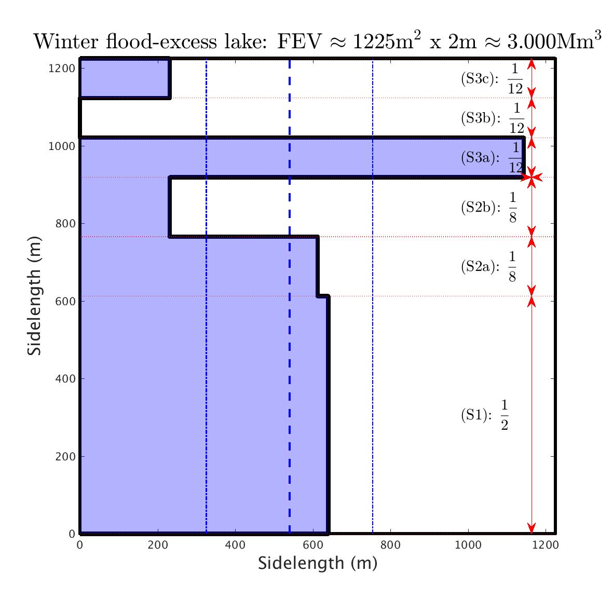

# RiverDon

## FEV analysis for the summer 2007 flood of the River Don in Sheffield

Work published on the (Earth)Arxiv as: 

Bokhove, O., Kelmanson, M., & Kent, T. (2018): On using flood-excess volume to assess natural flood management, exemplified for extreme 2007 and 2015 floods in Yorkshire. *EarthArxiv*. [DOI](https://doi.org/10.31223/osf.io/87z6w).

*Above figure (source: University of Sheffield https://www.sheffield.ac.uk/doncatchment/about (c) Crown Copyright/database right 2011; an Ordnance Survey/EDINA supplied service; river layer kindly licensed from the Environment Agency): The River Don around the Sheffield City region, including the upper Don catchment and the River Sheaf. In Sheffield, the Don is fed by four other rivers: the Sheaf, Loxley, Riverlin, and Porter. The Sheffield Hadfields gauge is located centrally downstream of the Sheaf.*

### Some Graphical output 

#### Data analysis: from depth to discharge to FEV

#### Cost-effectiveness analysis: seasonal rainfall scenarios

 |  
